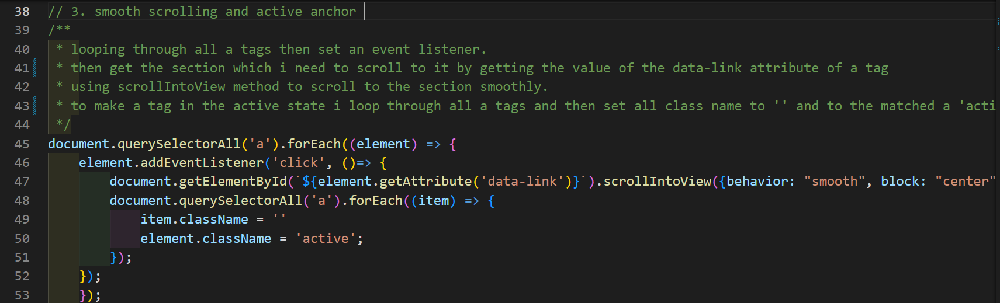

# 🎯 Landing Page Project

## Description:
the first project in the <b>FWD professional  </b> for web development is to make a landing page. this project aim to practice JS in real world projects. this project focuses on manipulating the DOM using js and to add all features required using JS (dynamically).

## ILOs:
- How many files do I need?
- Do I modify the HTML first or the CSS?
- How many JavaScript functions do I need?
- Should my function be this many lines of code?
- Is readability or performance more important?

## Live Demo
- https://ziad-shaaban.github.io/landing-page/
## 📃 Table of Contents

[✔] 1. make a responsive landing page.
- in this requirement the landing page should be responsive in all devices.
- styling the landing page. 

[✔] add 4 section of content to the page.

[✔] build navigation bar dynamically using js.

[✔] adding section titles == section title and with the same number.

[✔] change the active class which have css style to other section while scrolling

[✔] add nice smooth scroll during clicking navbar title using scrollIntoView method.

[✔] highlight the the navbar title after clicking.

[✔] highlight the relative section title while scrolling.
